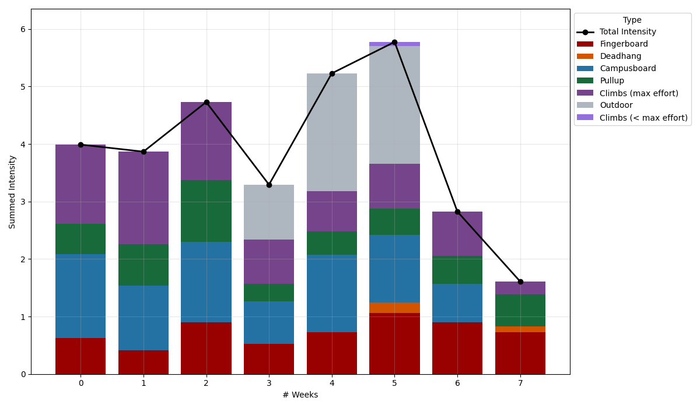
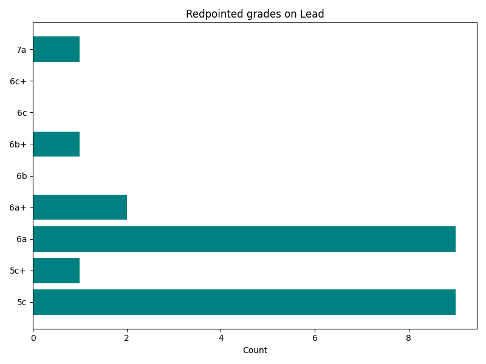
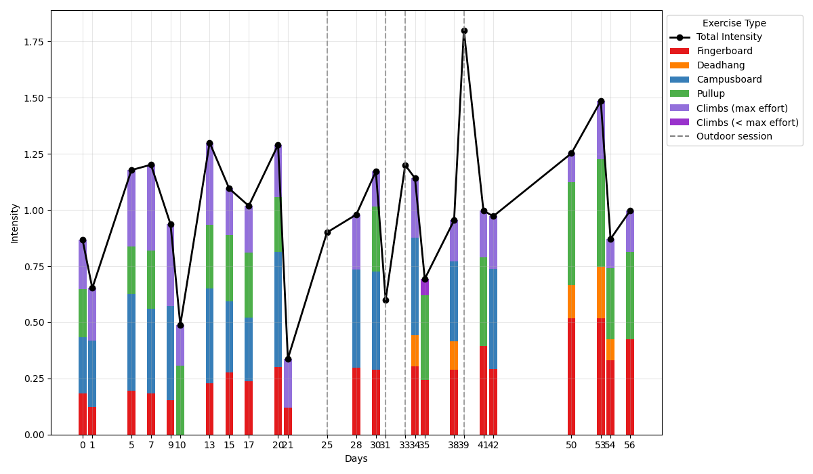
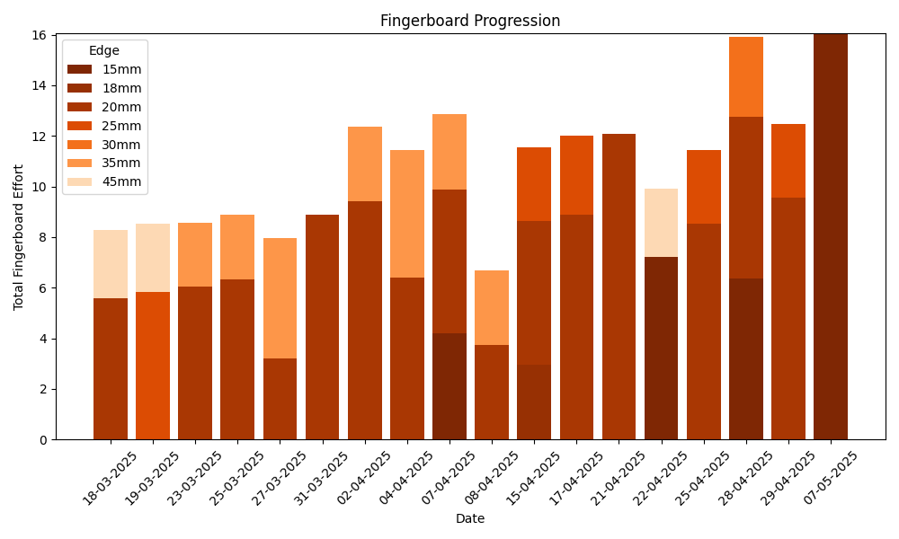
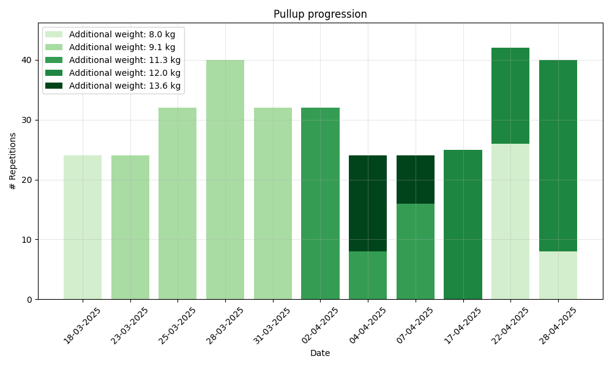
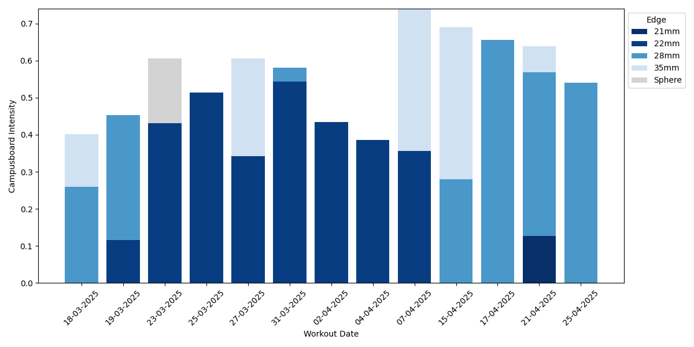

**CrimPy**
-

Python scripts to analyse and display data from workouts for rock climbing.

The goal is to monitor how the effort of climbing workouts increases with time. This should be at a pace that is steady enough to ensures progress,
yet not so fast to induce injuries.

Quantifying the effort of boulder problems and sport routes is not really possible. The picture here is very simplified, and tuned
to my personal experience. 

To see how the effort is computed, see ```src/crimPy/intensity./py```

Usage
-
The template files can be edited on the phone during a workout. They can be then moved in the ***data/*** directory. Run ```./makeplots.sh``` to produce the plots from all JSON files in ***data/***

Template files are:

- workout_template.json (bouldering and conditioning exercises)
- outdoor_template.json (lead and top-rope)

Installation is standard: run ```pip install .``` in the cloned directory.

Excercises supported:
-

- Bouldering
- Lead and top rope sport climbing
- Pullups
- Fingerboard (7:3 repeaters)
- Deadhang (1 or 2 hands)
- Campusboard moves


Examples of plots produced:
-













Example of estimated effort from excercise
--
***
**Fingerboard 7on 3off, six repeaters : Intensity for Edge Sizes**
```
Edge:   45 mm -> Intensity: 0.0317
Edge:   35 mm -> Intensity: 0.0414
Edge:   25 mm -> Intensity: 0.0595
Edge:   20 mm -> Intensity: 0.0757
Edge:   15 mm -> Intensity: 0.1034
Edge:   10 mm -> Intensity: 0.1609
Edge:    8 mm -> Intensity: 0.2054
Edge:    6 mm -> Intensity: 0.2814

```
***
**Pullups intensity for 8 reps varying weight**

```
Weight:  0 → Intensity: 0.0385
Weight:  8 → Intensity: 0.0620
Weight: 10 → Intensity: 0.0693
Weight: 14 → Intensity: 0.0858
Weight: 18 → Intensity: 0.1051
Weight: 20 → Intensity: 0.1159
Weight: 24 → Intensity: 0.1399
Weight: 32 → Intensity: 0.1989

```