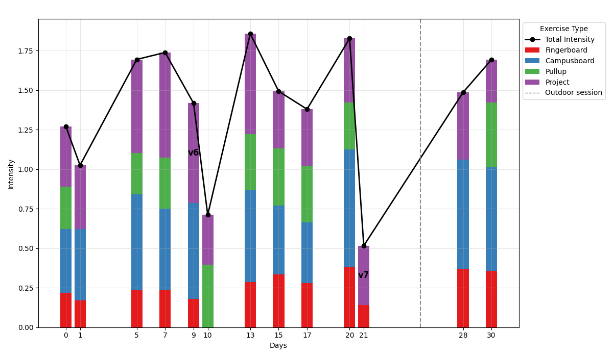

**CrimPy**
-

Python scripts to analyse and display data from workouts for rock climbing, in order to track progressions and changes of intensity.

Intensity is measured for certain exercises (see below) from empirical formulae which can be found in ```src/crimPy/intensity./py```

The template file *"workout_template.json"* provided in the project directory can be edited on the phone during a workout,
and then copied in the data/ directory to be analysed.

Excercises supported:
-

- Campus moves
- Pullup
- Fingerboard
- Projects

Examples of plot produced:
-


